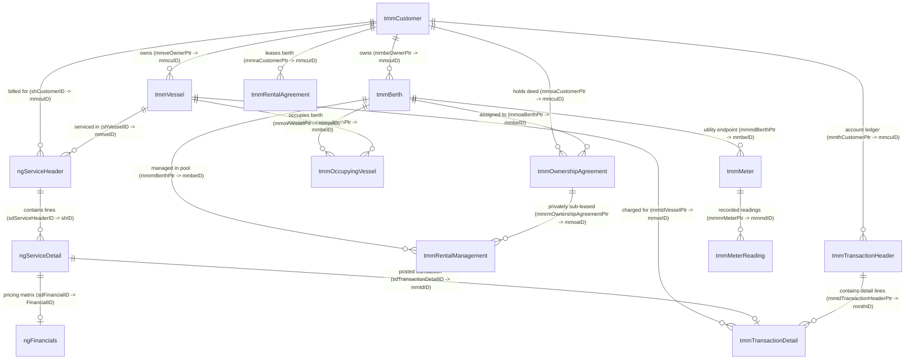

# Pacsoft NG Database Knowledge Base

## Overview & Environment Configuration
- **Database Name:** `MMS_WH_P`
- **Server Location:** `localhost`
- **Primary Schema:** `dbo`
- **Base Tables Count:** 392
- **Views Count:** 960 (including user-scoped custom views)
- **Access Policy:** **STRICT READ-ONLY** (Metadata discovery and `SELECT` queries only).

---

## 1. Database Structure & Naming Conventions

The Pacsoft NG database architecture consists of two integrated domain frameworks:

1. **`tmm...` Framework (Traditional Marina Management System):**
   - Core operational entities covering marina customers (`tmmCustomer`), vessels (`tmmVessel`), berths/slips (`tmmBerth`), rental leases (`tmmRentalAgreement`), ownership deeds (`tmmOwnershipAgreement`), meters (`tmmMeter`), and transaction ledgers (`tmmTransactionHeader`, `tmmTransactionDetail`).
   - Primary foreign key column naming convention uses table-specific prefix + `Ptr` suffix (e.g., `mmcuID` is referenced as `mmbeOwnerPtr`, `mmveOwnerPtr`, or `mmraCustomerPtr`).

2. **`ng...` Framework (Next-Gen Service Engine & Module Layer):**
   - Modern service management module (`ngServiceHeader`, `ngServiceDetail`), detailed financial calculations (`ngFinancials`), occupancy summaries (`ngOccupancyBase`), categories, and messaging/queues.
   - Primary foreign key column naming convention uses `...ID` suffix (e.g., `shCustomerID`, `sdFinancialID`, `sdServiceHeaderID`).

---

## 2. Schemas & User Views
- **`dbo` Schema:** Contains all primary physical base tables and standard system views.
- **User Schemas:** Custom report/view schemas exist (e.g., `AKLC\PowerA`, `AUCKLAND\GerranP`, `WESTHAVEN\Kyla`). These contain analytical or user-created views; core queries should target `dbo`.

---

## 3. Major Business Areas & Summary Table

| Major Business Area | Primary Table(s) | Key Foreign Pointer(s) | Business Domain Role |
| :--- | :--- | :--- | :--- |
| **Customers** | `tmmCustomer` | `mmcuID` | Central account and contact registry for boat owners, berth holders, and vendors. |
| **Vessels** | `tmmVessel` | `mmveOwnerPtr` $\rightarrow$ `tmmCustomer` | Physical vessel profiles, dimensions, safety certificates, and insurance records. |
| **Berths & Locations** | `tmmBerth` | `mmbeMarinaPtr` $\rightarrow$ `tmmMarina` | Physical slips, moorings, and dry stack assets managed by the marina. |
| **Service Headers** | `ngServiceHeader` | `shCustomerID`, `shVesselID` | Master job tickets, work orders, maintenance jobs, and recurring service agreements. |
| **Service Details** | `ngServiceDetail` | `sdServiceHeaderID`, `sdFinancialID` | Line-item labor tasks, product charges, and parts attached to a service job. |
| **Rental Pool Management**| `tmmRentalManagement` | `mmrmBerthPtr`, `mmrmOwnershipAgreementPtr` | Rental pool contract for private berth owners subleasing their berth back to the marina. |
| **Rental Agreements** | `tmmRentalAgreement` | `mmraCustomerPtr`, `mmraMarinaPtr` | Tenant lease contracts for renting slips from the marina or rental pool. |
| **Ownership Agreements** | `tmmOwnershipAgreement` | `mmoaBerthPtr`, `mmoaCustomerPtr` | Long-term ownership deeds, licenses, or rights-to-occupy agreements for berth owners. |
| **Financial Calculations** | `ngFinancials` | `sdFinancialID` $\leftarrow$ `ngServiceDetail` | Detailed cost, markup, tax, and sales price breakdown engine. |
| **Invoices & Transactions**| `tmmTransactionHeader`, `tmmTransactionDetail` | `mmthCustomerPtr`, `mmtdTransactionHeaderPtr` | General ledger posting engine for invoices, receipts, credit notes, and adjustments. |
| **Occupancy & Movements** | `tmmOccupyingVessel` | `mmovBerthPtr`, `mmovVesselPtr` | Daily physical stay tracking log for dock walks and movement history. |
| **Utilities & Meters** | `tmmMeter`, `tmmMeterReading` | `mmmdBerthPtr`, `mmmrMeterPtr` | Hardware meter definitions and reading log entries for power and water. |
| **History & Audit** | `tmmHistory`, `tmmAuditEvent` | `mmhyReferencePtr`, `mmauRecordID` | Audit trails of user changes (`tmmAuditEvent`) and document/communication history (`tmmHistory`). |

---

## 4. Business Meaning & Detailed Structure of Core Tables

### 1) TABLE: `ngServiceHeader`
- **PURPOSE:** Header record for service work orders, yard maintenance jobs, repairs, and recurring billing headers.
- **PRIMARY KEY:** `shID` (`int`)
- **IMPORTANT COLUMNS:**
  - `shID` (PK)
  - `shCustomerID` (FK $\rightarrow$ `tmmCustomer.mmcuID`)
  - `shVesselID` (FK $\rightarrow$ `tmmVessel.mmveID`)
  - `shMarinaID` (FK $\rightarrow$ `tmmMarina.mmmaID`)
  - `shBillingAgentID` (FK $\rightarrow$ `tmmBillingAgent.mmbaID`)
  - `shStatus` (Status text, e.g. Open/Closed/Completed)
  - `shJobSummaryDescription` (Summary description of work)
  - `shEnteredByID` (FK $\rightarrow$ `tmmEmployee.mmemID`)
  - `shEnteredDate`
  - `shStartDate`, `shEndDate`
  - `shScheduledDate`, `shCompleteDate`
  - `shLastInvoiceNumber`, `shLastInvoiceDate`, `shLastInvoiceAmount`
- **RELATIONSHIPS:**
  - `shCustomerID` $\rightarrow$ `tmmCustomer.mmcuID`
  - `shVesselID` $\rightarrow$ `tmmVessel.mmveID`
  - `shMarinaID` $\rightarrow$ `tmmMarina.mmmaID`
  - `shEnteredByID` $\rightarrow$ `tmmEmployee.mmemID`
- **DATE FIELDS:** `shEnteredDate`, `shStartDate`, `shEndDate`, `shPeriodFrom`, `shPeriodTo`, `shScheduledDate`, `shCompleteDate`, `shReviewDate`, `shTerminationDate`, `shDepartureDate`, `shModifiedDate`, `shLastInvoiceDate`, `shContractStartDate`
- **STATUS/TYPE FIELDS:** `shStatus` (`nvarchar`), `shLineType` (`varchar`), `shAnalysisTypeID` (`int`), `shAutoPaymentMethodID` (`int`), `shPaymentMethodID` (`int`), `shDoNotProcess` (`bit`), `shDoNotInvoice` (`bit`), `shIsCustomerCharge` (`bit`), `shIsVesselCharge` (`bit`), `shLiveAboard` (`bit`), `shArchive` (`bit`)
- **BUSINESS MEANING:** Serves as the master work order or service job umbrella grouping task and product line items (`ngServiceDetail`).

---

### 2) TABLE: `ngServiceDetail`
- **PURPOSE:** Line item record under a service job, representing individual tasks, labor hours, inventory items, parts, or fee charges.
- **PRIMARY KEY:** `sdID` (`int`)
- **IMPORTANT COLUMNS:**
  - `sdID` (PK)
  - `sdServiceHeaderID` (FK $\rightarrow$ `ngServiceHeader.shID`)
  - `sdLineNo` (Line sequence number)
  - `sdProductID` (FK $\rightarrow$ `tmmProduct.mmprID`)
  - `sdFinancialID` (FK $\rightarrow$ `ngFinancials.FinancialID`)
  - `sdVesselID` (FK $\rightarrow$ `tmmVessel.mmveID`)
  - `sdRentalManagementID` (FK $\rightarrow$ `tmmRentalManagement.mmrmID`)
  - `sdTransactionDetailID` (FK $\rightarrow$ `tmmTransactionDetail.mmtdID`)
  - `sdInvoiceDescription`, `sdTaskDescription`
  - `sdWorkHours`, `sdChargeHours`
  - `sdStatus`, `sdLineType`, `sdTaskType`
- **RELATIONSHIPS:**
  - `sdServiceHeaderID` $\rightarrow$ `ngServiceHeader.shID`
  - `sdFinancialID` $\rightarrow$ `ngFinancials.FinancialID`
  - `sdProductID` $\rightarrow$ `tmmProduct.mmprID`
  - `sdVesselID` $\rightarrow$ `tmmVessel.mmveID`
  - `sdRentalManagementID` $\rightarrow$ `tmmRentalManagement.mmrmID`
  - `sdTransactionDetailID` $\rightarrow$ `tmmTransactionDetail.mmtdID`
  - `sdEmployeeID` / `sdAssignedEmp` $\rightarrow$ `tmmEmployee.mmemID`
- **DATE FIELDS:** `sdStartDate`, `sdStartDateTime`, `sdEndDate`, `sdEndDateTime`, `sdInvoiceDate`, `sdInvoiceToDate`, `sdInvoiceFromDate`, `sdRequiredDate`, `sdEnteredDate`, `sdModifiedDate`, `sdDepartureDate`, `sdCancellationDate`, `sdAssignedDate`
- **STATUS/TYPE FIELDS:** `sdStatus` (`nvarchar`), `sdLineType` (`nvarchar`), `sdTaskType` (`nvarchar`), `sdEstimateType` (`nvarchar`), `sdNoChargeTask` (`bit`), `sdShowOnValueInvoice` (`bit`), `sdTaxExclusiveFlag` (`bit`), `sdStockedOut` (`bit`), `sdIsQuote` (`bit`), `sdIsActive` (`bit`)
- **BUSINESS MEANING:** Granular task or item entry. Stores task scope, links to pricing logic (`ngFinancials`), and tracks posting into financial transaction detail (`tmmTransactionDetail`).

---

### 3) TABLE: `tmmBerth`
- **PURPOSE:** Master asset inventory table for physical berths, slips, moorings, and storage locations.
- **PRIMARY KEY:** `mmbeID` (`int`)
- **IMPORTANT COLUMNS:**
  - `mmbeID` (PK)
  - `mmbeName` (Berth display code/name e.g., A-01)
  - `mmbeMarinaPtr` (FK $\rightarrow$ `tmmMarina.mmmaID`)
  - `mmbeStatus` (Status text)
  - `mmbeTypePtr` (FK $\rightarrow$ `tmmBerthType.mmbtID`)
  - `mmbeWidthTypePtr` (FK $\rightarrow$ `tmmBerthWidthType.mmbwID`)
  - `mmbeOwnerPtr` (FK $\rightarrow$ `tmmCustomer.mmcuID`)
  - `mmbePier` (Pier/Dock identifier e.g., Pier A)
  - `mmbeNominalLength`, `mmbeNominalWidth`, `mmbeNominalDepth`
  - `mmbeActualLength`, `mmbeActualWidth`, `mmbeActualDepth`
  - `mmbeSellingPrice`, `mmbeCostPrice`, `mmbeRental`
  - `mmbeActive`
- **RELATIONSHIPS:**
  - `mmbeMarinaPtr` $\rightarrow$ `tmmMarina.mmmaID`
  - `mmbeTypePtr` $\rightarrow$ `tmmBerthType.mmbtID`
  - `mmbeWidthTypePtr` $\rightarrow$ `tmmBerthWidthType.mmbwID`
  - `mmbeOwnerPtr` $\rightarrow$ `tmmCustomer.mmcuID`
  - `mmbeStatusPtr` $\rightarrow$ `tmmBerthStatus.mmbsID`
- **DATE FIELDS:** `mmbeEnteredDate`, `mmbeDecommissionedDate`, `mmbeInActiveDate`
- **STATUS/TYPE FIELDS:** `mmbeStatus` (`varchar`), `mmbeActive` (`bit`), `mmbeSiteIndicator` (`bit`), `mmbeRateIncluded` (`bit`), `mmbeInsuranceIncluded` (`bit`), `mmbeLandTaxIncluded` (`bit`)
- **BUSINESS MEANING:** Represents the physical slip or mooring location managed by the marina. Linked to owner records for private berths and rental contracts for tenant berths.

---

### 4) TABLE: `tmmCustomer`
- **PURPOSE:** Central customer registry storing personal profiles, billing details, contact info, and account balances.
- **PRIMARY KEY:** `mmcuID` (`int`)
- **IMPORTANT COLUMNS:**
  - `mmcuID` (PK)
  - `mmcuFirstName`, `mmcuSurname`, `mmcuLongName`
  - `mmcuTypePtr` (FK $\rightarrow$ `tmmCustomerType.mmctID`)
  - `mmcuAccountCode` (GL/ERP Account Reference)
  - `mmcuEmail`, `mmcuBusPhoneNo`, `mmcuMobileNo`
  - `mmcuAddressLine1`, `mmcuAddressLine2`, `mmcuAddressLine3`
  - `mmcuAccountBalance` (Current balance)
  - `mmcuAccountStatusPtr` (FK $\rightarrow$ `tmmAccountStatus.mmasID`)
  - `mmcuCustToBill` (FK $\rightarrow$ `tmmCustomer.mmcuID` for parent account)
  - `mmcuActive`
- **RELATIONSHIPS:**
  - `mmcuTypePtr` $\rightarrow$ `tmmCustomerType.mmctID`
  - `mmcuAccountStatusPtr` $\rightarrow$ `tmmAccountStatus.mmasID`
  - `mmcuCustToBill` $\rightarrow$ `tmmCustomer.mmcuID` (Self-referencing parent billing link)
  - `mmcuBankDetailPtr` $\rightarrow$ `tmmBankDetail.mmbdID`
  - `mmcuEnteredByPtr` $\rightarrow$ `tmmEmployee.mmemID`
- **DATE FIELDS:** `mmcuEnteredDate`, `mmcuInActiveDate`, `mmcuLastRefundDate`, `mmcuAutoPaymentDateStarted`, `mmcuCardExpiryDate`
- **STATUS/TYPE FIELDS:** `mmcuAccountStatusPtr` (`int`), `mmcuActive` (`bit`), `mmcuBerthPurchase` (`bit`), `mmcuRentalPoolFlag` (`bit`), `mmcuAutoPaymentInd` (`bit`), `mmcuCreditCardInd` (`bit`), `mmcuConfidentialIndicator` (`bit`)
- **BUSINESS MEANING:** Central record for all entity interactions. Stores credit terms, contact profiles, direct debit details, and billing consolidation setup.

---

### 5) TABLE: `tmmVessel`
- **PURPOSE:** Central boat register tracking dimensions, registration, insurance, and safety compliance.
- **PRIMARY KEY:** `mmveID` (`int`)
- **IMPORTANT COLUMNS:**
  - `mmveID` (PK)
  - `mmveVesselName`
  - `mmveOwnerPtr` (FK $\rightarrow$ `tmmCustomer.mmcuID`)
  - `mmveTypePtr` (FK $\rightarrow$ `tmmVesselType.mmvtID`)
  - `mmveModelPtr` (FK $\rightarrow$ `tmmVesselModel.mmvmID`)
  - `mmveLength`, `mmveBeam`, `mmveDraft`, `mmveTonnage`
  - `mmveRegistration`, `mmveRadioCallSign`
  - `mmveInsurer`, `mmvePolicy`, `mmvePolicyExpiryDate`
  - `mmveElectricalWOFNumber`, `mmveElectricalWOFExpiry`
  - `mmveActive`
- **RELATIONSHIPS:**
  - `mmveOwnerPtr` $\rightarrow$ `tmmCustomer.mmcuID`
  - `mmveTypePtr` $\rightarrow$ `tmmVesselType.mmvtID`
  - `mmveModelPtr` $\rightarrow$ `tmmVesselModel.mmvmID`
  - `mmveEnteredByPtr` $\rightarrow$ `tmmEmployee.mmemID`
  - `mmveGroundingTypePtr` $\rightarrow$ `tmmGroundingType.mmgtID`
- **DATE FIELDS:** `mmveEnteredDate`, `mmveInActiveDate`, `mmvePolicyExpiryDate`, `mmveElectricalWOFIssue`, `mmveElectricalWOFExpiry`, `mmveInspectionDate`, `mmveGasWOFIssue`, `mmveGasWOFExpiry`, `mmveLastSurveyDate`
- **STATUS/TYPE FIELDS:** `mmveActive` (`bit`), `mmveThirdPartyOnly` (`bit`), `mmveInspectedByStaff` (`bit`), `mmveHoldingTank` (`bit`), `mmveGreyWaterHolding` (`bit`), `mmveBlackWaterHolding` (`bit`)
- **BUSINESS MEANING:** Holds vessel specs required for berth matching, lift allocations, insurance validation, and regulatory compliance.

---

### 6) TABLE: `tmmRentalManagement`
- **PURPOSE:** Manages rental pool agreements when a private berth owner places their berth into the marina's rental pool.
- **PRIMARY KEY:** `mmrmID` (`int`)
- **IMPORTANT COLUMNS:**
  - `mmrmID` (PK)
  - `mmrmMarinaPtr` (FK $\rightarrow$ `tmmMarina.mmmaID`)
  - `mmrmBerthPtr` (FK $\rightarrow$ `tmmBerth.mmbeID`)
  - `mmrmOwnershipAgreementPtr` (FK $\rightarrow$ `tmmOwnershipAgreement.mmoaID`)
  - `mmrmCustomerToCreditPtr` (FK $\rightarrow$ `tmmCustomer.mmcuID`)
  - `mmrmAvailableFromDate`, `mmrmAvailableToDate`
  - `mmrmAgreedCommissionRate`
  - `mmrmStatusPtr` (FK $\rightarrow$ `tmmRentalManagementStatus.mmrsID`)
  - `mmrmActive`
- **RELATIONSHIPS:**
  - `mmrmMarinaPtr` $\rightarrow$ `tmmMarina.mmmaID`
  - `mmrmBerthPtr` $\rightarrow$ `tmmBerth.mmbeID`
  - `mmrmOwnershipAgreementPtr` $\rightarrow$ `tmmOwnershipAgreement.mmoaID`
  - `mmrmCustomerToCreditPtr` $\rightarrow$ `tmmCustomer.mmcuID`
  - `mmrmStatusPtr` $\rightarrow$ `tmmRentalManagementStatus.mmrsID`
- **DATE FIELDS:** `mmrmAvailableFromDate`, `mmrmAvailableToDate`, `mmrmStartInvoiceDate`, `mmrmLastInvoiceEndDate`, `mmrmEnteredDate`
- **STATUS/TYPE FIELDS:** `mmrmStatusPtr` (`int`), `mmrmActive` (`bit`), `mmrmSubLease` (`bit`), `mmrmBookingPriorityIndicator` (`varchar`)
- **BUSINESS MEANING:** Defines the revenue-sharing rules, commission rates, and time windows during which an owner's berth can be rented to transient or long-term tenants.

---

### 7) TABLE: `tmmRentalAgreement`
- **PURPOSE:** Tenant lease agreements for renting berths/slips from the marina or rental pool.
- **PRIMARY KEY:** `mmraID` (`int`)
- **IMPORTANT COLUMNS:**
  - `mmraID` (PK)
  - `mmraMarinaPtr` (FK $\rightarrow$ `tmmMarina.mmmaID`)
  - `mmraCustomerPtr` (FK $\rightarrow$ `tmmCustomer.mmcuID`)
  - `mmraRentalProductPtr` (FK $\rightarrow$ `tmmProduct.mmprID`)
  - `mmraSurchargeProductPtr` (FK $\rightarrow$ `tmmProduct.mmprID`)
  - `mmraRentalPeriodFrom`, `mmraRentalPeriodTo`
  - `mmraTerminationDate`
  - `mmraRentalBond`
  - `mmraActive`
- **RELATIONSHIPS:**
  - `mmraMarinaPtr` $\rightarrow$ `tmmMarina.mmmaID`
  - `mmraCustomerPtr` $\rightarrow$ `tmmCustomer.mmcuID`
  - `mmraCustomerToDebitPtr` $\rightarrow$ `tmmCustomer.mmcuID`
  - `mmraRentalProductPtr` $\rightarrow$ `tmmProduct.mmprID`
  - `mmraUsagePtr` $\rightarrow$ `tmmBerthUsage.mmbuID`
- **DATE FIELDS:** `mmraRentalPeriodFrom`, `mmraRentalPeriodTo`, `mmraRentalRateReviewDate`, `mmraTerminationDate`, `mmraStartDate`, `mmraEndDate`, `mmraContractStartDate`, `mmraDepartureDate`, `mmraEnteredDate`
- **STATUS/TYPE FIELDS:** `mmraActive` (`bit`), `mmraLiveAboardFlag` (`bit`), `flagDoNotProcess` (`bit`), `mmraInvoicingPeriod` (`int`), `mmraBillingAnniversary` (`smallint`)
- **BUSINESS MEANING:** Operational tenant contract governing rental duration, rate schedule, security bond, and automatic recurring billing cycles.

---

### 8) TABLE: `tmmOwnershipAgreement`
- **PURPOSE:** Long-term ownership deed/license contracts for berth buyers/owners.
- **PRIMARY KEY:** `mmoaID` (`int`)
- **IMPORTANT COLUMNS:**
  - `mmoaID` (PK)
  - `mmoaMarinaPtr` (FK $\rightarrow$ `tmmMarina.mmmaID`)
  - `mmoaBerthPtr` (FK $\rightarrow$ `tmmBerth.mmbeID`)
  - `mmoaCustomerPtr` (FK $\rightarrow$ `tmmCustomer.mmcuID`)
  - `mmoaOwnershipTypePtr` (FK $\rightarrow$ `tmmOwnershipType.mmotID`)
  - `mmoaStartDate`, `mmoaEndDate`
  - `mmoaPurchasePrice`, `mmoaOriginalPrice`
  - `mmoaEncumbered`
  - `mmoaActive`
- **RELATIONSHIPS:**
  - `mmoaMarinaPtr` $\rightarrow$ `tmmMarina.mmmaID`
  - `mmoaBerthPtr` $\rightarrow$ `tmmBerth.mmbeID`
  - `mmoaCustomerPtr` $\rightarrow$ `tmmCustomer.mmcuID`
  - `mmoaOwnershipTypePtr` $\rightarrow$ `tmmOwnershipType.mmotID`
  - `mmoaNominatedVesselPtr` $\rightarrow$ `tmmVessel.mmveID`
- **DATE FIELDS:** `mmoaStartDate`, `mmoaOccupationDate`, `mmoaEndDate`, `mmoaAnnualChargeLastInvoiceEndDate`, `mmoaPayStartDate`, `mmoaPrivateStartDate`, `mmoaEnteredDate`
- **STATUS/TYPE FIELDS:** `mmoaActive` (`bit`), `mmoaEncumbered` (`bit`), `mmoaPrivateRental` (`bit`), `mmoaLiveAboardFlag` (`bit`), `mmoaAnnualChargeMandatory` (`bit`), `mmoaContractStatusPtr` (`int`)
- **BUSINESS MEANING:** Berth deed or long-term lease contract tracking owner privileges, maintenance fee obligations, and encumbrances (mortgages/liens).

---

### 9) TABLES: `tmmTransactionHeader` & `tmmTransactionDetail`
- **PURPOSE:** Financial accounting posting engine (Invoices, Credit Notes, Receipts, Payments, Refunds).
- **PRIMARY KEYS:** `mmthID` (`int`) / `mmtdID` (`int`)
- **IMPORTANT COLUMNS:**
  - `tmmTransactionHeader`: `mmthID` (PK), `mmthTransactionTypePtr`, `mmthCustomerPtr`, `mmthMarinaPtr`, `mmthAmount`, `mmthGST`, `mmthTransactionDate`, `mmthDescription`, `mmthOriginalRef`
  - `tmmTransactionDetail`: `mmtdID` (PK), `mmtdTransactionHeaderPtr` (FK), `mmtdCustomerPtr`, `mmtdBerthPtr`, `mmtdVesselPtr`, `mmtdProductPtr`, `mmtdAmount`, `mmtdGST`, `mmtdGLAccountCode`, `mmtdUnits`, `mmtdRate`
- **RELATIONSHIPS:**
  - `mmtdTransactionHeaderPtr` $\rightarrow$ `tmmTransactionHeader.mmthID`
  - `mmthCustomerPtr` / `mmtdCustomerPtr` $\rightarrow$ `tmmCustomer.mmcuID`
  - `mmtdBerthPtr` $\rightarrow$ `tmmBerth.mmbeID`
  - `mmtdVesselPtr` $\rightarrow$ `tmmVessel.mmveID`
  - `mmtdProductPtr` $\rightarrow$ `tmmProduct.mmprID`
  - `mmthTransactionTypePtr` $\rightarrow$ `tmmTransactionType.mmttID`
- **DATE FIELDS:** `mmthTransactionDate`, `mmthBillingPeriodFrom`, `mmthBillingPeriodTo`, `mmthEnteredDate`, `mmtdStartDate`, `mmtdEndDate`, `mmtdEnteredDate`
- **STATUS/TYPE FIELDS:** `mmthDebitCredit` (`varchar`), `mmthAllocated` (`bit`), `mmthPurgedFlag` (`bit`), `mmthExportFlag` (`bit`), `mmtdPurgedFlag` (`bit`)
- **BUSINESS MEANING:** Central posting ledger holding all financial movements. Stores header control totals and line-item GL splits.

---

### 10) TABLE: `ngFinancials`
- **PURPOSE:** Pricing calculation engine for Next Gen service details.
- **PRIMARY KEY:** `FinancialID` (`int`)
- **IMPORTANT COLUMNS:** `FinancialID`, `fQuantity`, `fSalesRate`, `fSalesTotalAmount`, `fSalesTaxAmount`, `fCostRate`, `fCostTotalAmount`, `fMarkUpPerc`, `fMarkUpAmount`, `fMarginAchivedPerc`, `fCreatedDate`
- **RELATIONSHIPS:** `sdFinancialID` in `ngServiceDetail` $\rightarrow$ `ngFinancials.FinancialID`
- **DATE FIELDS:** `fCreatedDate`, `fModifiedDate`, `EnteredTStamp`, `ModifiedTStamp`
- **STATUS/TYPE FIELDS:** `fMarkUpType` (`int`), `fTaxEX` (`bit`), `fUseDiscountAmount` (`bit`)
- **BUSINESS MEANING:** Stores financial cost, margin, markup, and discount metrics for each service job line item.

---

### 11) TABLE: `tmmOccupyingVessel`
- **PURPOSE:** Tracks physical stay of vessels in berths over time.
- **PRIMARY KEY:** `mmovID` (`int`)
- **IMPORTANT COLUMNS:** `mmovID`, `mmovBerthPtr`, `mmovVesselPtr`, `mmovCustomerPtr`, `mmovDateIn`, `mmovDateOut`, `mmovAgreementPtr`, `mmovAgreementType`, `mmovLiveAboardFlag`
- **RELATIONSHIPS:**
  - `mmovBerthPtr` $\rightarrow$ `tmmBerth.mmbeID`
  - `mmovVesselPtr` $\rightarrow$ `tmmVessel.mmveID`
  - `mmovCustomerPtr` $\rightarrow$ `tmmCustomer.mmcuID`
- **DATE FIELDS:** `mmovDateIn`, `mmovDateOut`, `mmovEnteredDate`
- **STATUS/TYPE FIELDS:** `mmovTypePtr` (`int`), `mmovLiveAboardFlag` (`bit`), `mmovInvoicePrivateRenter` (`bit`)
- **BUSINESS MEANING:** Physical arrival/departure record used for marina dock walk validation, occupancy reporting, and transient stay calculation.

---

### 12) TABLES: `tmmMeter` & `tmmMeterReading`
- **PURPOSE:** Utility hardware meter tracking and meter reading logs for power/water billing.
- **PRIMARY KEYS:** `mmmdID` (`int`) / `mmmrID` (`int`)
- **IMPORTANT COLUMNS:**
  - `tmmMeter`: `mmmdID`, `mmmdName`, `mmmdBerthPtr`, `mmmdCurrentReading`, `mmmdCurrentReadingDate`, `mmmdMasterMeterPtr`, `mmmdRolloverValue`
  - `tmmMeterReading`: `mmmrID`, `mmmrMeterPtr`, `mmmrCustomerPtr`, `mmmrBerthPtr`, `mmmrVesselPtr`, `mmmrPreviousReading`, `mmmrNewReading`, `mmmrInvoiced`, `mmmrRate`
- **RELATIONSHIPS:**
  - `mmmdBerthPtr` / `mmmrBerthPtr` $\rightarrow$ `tmmBerth.mmbeID`
  - `mmmrMeterPtr` $\rightarrow$ `tmmMeter.mmmdID`
  - `mmmrCustomerPtr` $\rightarrow$ `tmmCustomer.mmcuID`
  - `mmmrVesselPtr` $\rightarrow$ `tmmVessel.mmveID`
- **DATE FIELDS:** `mmmdCurrentReadingDate`, `mmmrPreviousReadingDate`, `mmmrCurrentReadingDate`
- **STATUS/TYPE FIELDS:** `mmmdOnOff` (`bit`), `mmmdInUse` (`bit`), `mmmrInvoiced` (`bit`), `mmmrFinalReading` (`bit`)
- **BUSINESS MEANING:** Tracks utility hardware installed on pedestals and logs reading increments to bill power and water consumption to customers.

---

## 5. Verified Reference & Status Lookups

| Lookup Table Name | Primary Key | Name/Description Column | Key Verified Values / Examples |
| :--- | :--- | :--- | :--- |
| `tmmBerthStatus` | `mmbsID` | `mmbsDescription` | `1`: Active, `2`: Decommissioned |
| `tmmAccountStatus` | `mmasID` | `mmasDescription` | `2`: Billing Agent, `4`: Bad Debtor - DD only!! |
| `tmmRentalManagementStatus` | `mmrsID` | `mmrsStatusName` | Operational status values for rental pool berths |
| `tmmContractStatus` | `mmcsID` | `mmcsDescription` | Contract lifecycle states (Draft, Active, Terminated) |
| `tmmTransactionType` | `mmttID` | `mmttTypeDescription` | Invoices, Receipts, Credit Notes, Adjustments |
| `tmmCustomerType` | `mmctID` | `mmctTypeName` | Individual, Commercial, Billing Agent |
| `tmmVesselType` | `mmvtID` | `mmvtName` | Launch, Yacht, Catamaran, Commercial |

---

## 6. Important Pacsoft NG Business Concepts

1. **Dual-Engine Architecture (`tmm` vs `ng`):**
   - Traditional marina management functions (berth inventory, lease contracts, customer accounts, general ledger) run on `tmm` tables.
   - Modern service tasks, work orders, parts tracking, and financial margin calculations run on `ng` tables (`ngServiceHeader`, `ngServiceDetail`, `ngFinancials`).

2. **Customer vs. Owner vs. Tenant:**
   - **Customer (`tmmCustomer`):** The primary entity billed for services or rentals.
   - **Berth Owner:** Holds a long-term deed (`tmmOwnershipAgreement`) for a berth asset.
   - **Tenant / Renter:** Rents a berth via a short or long-term lease (`tmmRentalAgreement`).

3. **Rental Pool Mechanics:**
   - When a private berth owner is not using their berth, they can place it in the marina rental pool via `tmmRentalManagement`.
   - The marina then rents the berth to a tenant via `tmmRentalAgreement`, and revenue is shared according to `mmrmAgreedCommissionRate`.

4. **Physical Occupancy vs. Financial Contracts:**
   - A contract (`tmmRentalAgreement`) defines financial billing.
   - Physical occupancy (`tmmOccupyingVessel`) records actual arrival (`mmovDateIn`) and departure (`mmovDateOut`) of boats in berths, used during daily dock walks.

---

## 7. Verified Relationship Map

---

## 8. Verified Foreign Key Link Matrix

| Parent Table | Parent Key | Child Table | Child Foreign Pointer | Description |
| :--- | :--- | :--- | :--- | :--- |
| `tmmCustomer` | `mmcuID` | `tmmVessel` | `mmveOwnerPtr` | Vessel primary owner link |
| `tmmCustomer` | `mmcuID` | `tmmBerth` | `mmbeOwnerPtr` | Private berth owner link |
| `tmmCustomer` | `mmcuID` | `tmmRentalAgreement` | `mmraCustomerPtr` | Tenant leasing the berth |
| `tmmCustomer` | `mmcuID` | `tmmOwnershipAgreement` | `mmoaCustomerPtr` | Owner holding berth deed |
| `tmmCustomer` | `mmcuID` | `ngServiceHeader` | `shCustomerID` | Service work order customer |
| `tmmCustomer` | `mmcuID` | `tmmTransactionHeader` | `mmthCustomerPtr` | Transaction ledger customer |
| `tmmBerth` | `mmbeID` | `tmmOwnershipAgreement` | `mmoaBerthPtr` | Berth assigned to ownership agreement |
| `tmmBerth` | `mmbeID` | `tmmRentalManagement` | `mmrmBerthPtr` | Berth placed in rental pool |
| `tmmBerth` | `mmbeID` | `tmmOccupyingVessel` | `mmovBerthPtr` | Physical berth occupied by vessel |
| `tmmBerth` | `mmbeID` | `tmmMeter` | `mmmdBerthPtr` | Utility meter hardware attached to berth |
| `tmmVessel` | `mmveID` | `tmmOccupyingVessel` | `mmovVesselPtr` | Vessel occupying berth |
| `tmmVessel` | `mmveID` | `ngServiceHeader` | `shVesselID` | Vessel being serviced in job |
| `tmmVessel` | `mmveID` | `tmmTransactionDetail` | `mmtdVesselPtr` | Line item transaction charged to vessel |
| `ngServiceHeader` | `shID` | `ngServiceDetail` | `sdServiceHeaderID` | Service job detail lines |
| `ngFinancials` | `FinancialID` | `ngServiceDetail` | `sdFinancialID` | Line item pricing breakdown |
| `tmmTransactionHeader`| `mmthID` | `tmmTransactionDetail` | `mmtdTransactionHeaderPtr` | Financial transaction line details |
| `tmmMeter` | `mmmdID` | `tmmMeterReading` | `mmmrMeterPtr` | Meter readings for utility meter |

---

## 9. Items Requiring Site-Specific Data Verification
The following items depend on site-specific user configuration or custom setups and should be treated as:
**UNKNOWN – NEEDS VERIFICATION**

1. **Custom Lookup ID mappings (`ComboItemsValue`, `ngTypes`):** Specific integer values for user-defined custom categories, custom fields (`mmcuCustomText1`), or custom dropdown options.
2. **GL Chart of Accounts Mapping (`tmmGLTranslation`, `tmmGLDestination`):** External ERP system GL account codes (e.g. Sage, Dynamics, Sun) configured per marina installation.
3. **Stored Procedure Logic:** Site-specific automated batch scripts or custom triggers not documented in standard database catalog constraints.
