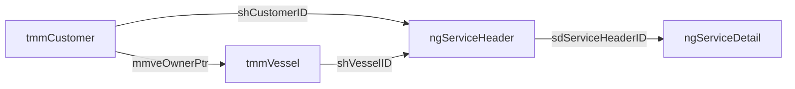
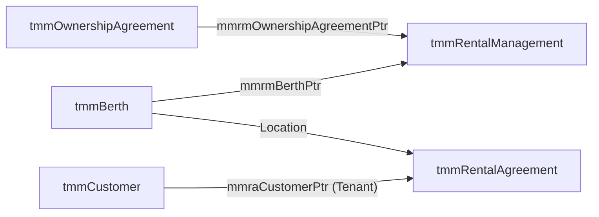

# Pacsoft NG Database Knowledge & Reference Base

> **CRITICAL SAFETY RULE – STRICTLY READ-ONLY**  
> THIS DATABASE (`MMS_WH_P`) IS OPERATED UNDER A STRICT READ-ONLY POLICY.  
> Never generate, recommend, or execute `INSERT`, `UPDATE`, `DELETE`, `MERGE`, `TRUNCATE`, `DROP`, `ALTER`, `CREATE`, or modifying `EXEC` statements. Only `SELECT` queries, CTEs, and read-only schema queries are permitted.

---

## 1. Core Tables & Their Purpose

| Table Name | Primary Key | Business Domain Purpose |
| :--- | :--- | :--- |
| `tmmCustomer` | `mmcuID` | Central customer registry storing account profiles, contact details, balance, and billing hierarchy. |
| `tmmVessel` | `mmveID` | Master vessel registry storing boat dimensions, owner links, insurance policies, and safety certificates (WOF). |
| `tmmBerth` | `mmbeID` | Physical marina assets (slips, berths, moorings, dry stacks) managed by the marina. |
| `ngServiceHeader` | `shID` | Header ticket for service jobs, yard work orders, yard repairs, and recurring billing schedules. |
| `ngServiceDetail` | `sdID` | Granular line items under a service header (labor tasks, product sales, parts, or fee charges). |
| `tmmRentalAgreement` | `mmraID` | Active tenant leasing contracts for renting slips from the marina or rental pool. |
| `tmmRentalManagement` | `mmrmID` | Rental pool management contracts for private berth owners subleasing their berths to the marina. |
| `tmmOwnershipAgreement` | `mmoaID` | Long-term ownership deeds or rights-to-occupy contracts held by berth owners. |
| `tmmTransactionHeader` | `mmthID` | Financial ledger header for posted invoices, credit notes, receipts, and payments. |
| `tmmTransactionDetail` | `mmtdID` | Financial ledger line items detailing product codes, quantities, taxes, and GL account allocations. |
| `ngFinancials` | `FinancialID` | Pricing, cost, markup, tax, and margin calculation matrix for `ngServiceDetail` lines. |
| `tmmOccupyingVessel` | `mmovID` | Physical movement and stay tracking log of vessels parked in berths over time. |
| `tmmMeter` | `mmmdID` | Physical utility hardware meters (electricity/water) installed on pedestals/docks. |
| `tmmMeterReading` | `mmmrID` | Historical reading logs recorded on utility meters to generate usage billing. |
| `tmmHistory` | `mmhyID` | Customer communication log, document attachments, and history notes. |
| `tmmAuditEvent` | `mmauID` | System data audit trail logging insert, update, and delete actions with old/new values. |

---

## 2. Important Columns in Core Tables

### `tmmCustomer`
- `mmcuID` (`int`, PK): Unique Customer ID.
- `mmcuFirstName`, `mmcuSurname`, `mmcuLongName` (`nvarchar`): Contact names.
- `mmcuAccountCode` (`nvarchar`): External GL / ERP account code.
- `mmcuCustToBill` (`int`, FK): Parent account ID for consolidated billing.
- `mmcuAccountBalance` (`money`): Outstanding account ledger balance.
- `mmcuAccountStatusPtr` (`int`, FK $\rightarrow$ `tmmAccountStatus`): Account standing status.
- `mmcuActive` (`bit`): Active account flag (`1` = Active, `0` = Inactive).

### `tmmVessel`
- `mmveID` (`int`, PK): Unique Vessel ID.
- `mmveVesselName` (`nvarchar`): Vessel name.
- `mmveOwnerPtr` (`int`, FK $\rightarrow$ `tmmCustomer`): Primary owner ID.
- `mmveTypePtr` (`int`, FK $\rightarrow$ `tmmVesselType`): Vessel type classification.
- `mmveLength`, `mmveBeam`, `mmveDraft` (`float`): Vessel physical dimensions.
- `mmveRegistration`, `mmveRadioCallSign` (`nvarchar`): Official registration codes.
- `mmvePolicyExpiryDate`, `mmveElectricalWOFExpiry`, `mmveGasWOFExpiry` (`datetime`): Compliance & insurance expiry dates.
- `mmveActive` (`bit`): Active status.

### `tmmBerth`
- `mmbeID` (`int`, PK): Unique Berth ID.
- `mmbeName` (`char`/`varchar`): Slip display name/code (e.g. A-12).
- `mmbeMarinaPtr` (`int`, FK $\rightarrow$ `tmmMarina`): Marina facility link.
- `mmbeTypePtr` (`int`, FK $\rightarrow$ `tmmBerthType`): Slip type (Wet Slip, Mooring, Dry Stack).
- `mmbeOwnerPtr` (`int`, FK $\rightarrow$ `tmmCustomer`): Private owner ID (if privately held).
- `mmbeNominalLength`, `mmbeNominalWidth`, `mmbeNominalDepth` (`float`): Slip dimensions.
- `mmbeStatus` (`varchar`): Current berth operational status text.
- `mmbeActive` (`bit`): Operational status flag.

### `ngServiceHeader` & `ngServiceDetail`
- `shID` (`int`, PK): Service Header ID.
- `shCustomerID` (`int`, FK $\rightarrow$ `tmmCustomer`): Customer billed for the job.
- `shVesselID` (`int`, FK $\rightarrow$ `tmmVessel`): Vessel being serviced.
- `shStatus` (`nvarchar`): Job header status (e.g. Open, Completed, Closed).
- `sdID` (`int`, PK): Service Detail Line ID.
- `sdServiceHeaderID` (`int`, FK $\rightarrow$ `ngServiceHeader`): Header reference.
- `sdProductID` (`int`, FK $\rightarrow$ `tmmProduct`): Product or service charge code.
- `sdFinancialID` (`int`, FK $\rightarrow$ `ngFinancials`): Financial pricing matrix record.
- `sdTransactionDetailID` (`int`, FK $\rightarrow$ `tmmTransactionDetail`): Posted transaction detail link.
- `sdWorkHours`, `sdChargeHours` (`float`): Labor task tracking hours.

### `tmmRentalAgreement` & `tmmRentalManagement`
- `mmraID` (`int`, PK): Rental Lease Agreement ID.
- `mmraCustomerPtr` (`int`, FK $\rightarrow$ `tmmCustomer`): Tenant customer ID.
- `mmraRentalProductPtr` (`int`, FK $\rightarrow$ `tmmProduct`): Rental product rate code.
- `mmraRentalPeriodFrom`, `mmraRentalPeriodTo` (`datetime`): Active lease period dates.
- `mmrmID` (`int`, PK): Rental Pool Management Contract ID.
- `mmrmBerthPtr` (`int`, FK $\rightarrow$ `tmmBerth`): Berth placed in rental pool.
- `mmrmOwnershipAgreementPtr` (`int`, FK $\rightarrow$ `tmmOwnershipAgreement`): Owner deed reference.
- `mmrmAgreedCommissionRate` (`float`): Marina commission percentage for rental sub-leasing.

### `tmmTransactionHeader` & `tmmTransactionDetail`
- `mmthID` (`int`, PK): Transaction Header ID (Invoice/Receipt/Credit Note).
- `mmthCustomerPtr` (`int`, FK $\rightarrow$ `tmmCustomer`): Transaction customer account.
- `mmthAmount`, `mmthGST` (`money`): Total header monetary values.
- `mmtdID` (`int`, PK): Transaction Detail Line ID.
- `mmtdTransactionHeaderPtr` (`int`, FK $\rightarrow$ `tmmTransactionHeader`): Parent header ID.
- `mmtdGLAccountCode` (`varchar`): General ledger account classification.
- `mmtdAmount`, `mmtdGST` (`money`): Line-item monetary amounts.

---

## 3. Primary & Foreign Keys Summary

```
Table                    Primary Key      Foreign Keys
----------------------   -----------      -------------------------------------------------------
tmmCustomer              mmcuID           mmcuCustToBill -> tmmCustomer.mmcuID
                                          mmcuAccountStatusPtr -> tmmAccountStatus.mmasID
tmmVessel                mmveID           mmveOwnerPtr -> tmmCustomer.mmcuID
                                          mmveTypePtr -> tmmVesselType.mmvtID
tmmBerth                 mmbeID           mmbeMarinaPtr -> tmmMarina.mmmaID
                                          mmbeOwnerPtr -> tmmCustomer.mmcuID
                                          mmbeTypePtr -> tmmBerthType.mmbtID
ngServiceHeader          shID             shCustomerID -> tmmCustomer.mmcuID
                                          shVesselID -> tmmVessel.mmveID
                                          shMarinaID -> tmmMarina.mmmaID
ngServiceDetail          sdID             sdServiceHeaderID -> ngServiceHeader.shID
                                          sdFinancialID -> ngFinancials.FinancialID
                                          sdProductID -> tmmProduct.mmprID
                                          sdTransactionDetailID -> tmmTransactionDetail.mmtdID
tmmRentalAgreement       mmraID           mmraCustomerPtr -> tmmCustomer.mmcuID
                                          mmraMarinaPtr -> tmmMarina.mmmaID
                                          mmraRentalProductPtr -> tmmProduct.mmprID
tmmRentalManagement      mmrmID           mmrmBerthPtr -> tmmBerth.mmbeID
                                          mmrmOwnershipAgreementPtr -> tmmOwnershipAgreement.mmoaID
                                          mmrmCustomerToCreditPtr -> tmmCustomer.mmcuID
tmmOwnershipAgreement    mmoaID           mmoaBerthPtr -> tmmBerth.mmbeID
                                          mmoaCustomerPtr -> tmmCustomer.mmcuID
tmmTransactionHeader     mmthID           mmthCustomerPtr -> tmmCustomer.mmcuID
tmmTransactionDetail     mmtdID           mmtdTransactionHeaderPtr -> tmmTransactionHeader.mmthID
                                          mmtdBerthPtr -> tmmBerth.mmbeID
                                          mmtdVesselPtr -> tmmVessel.mmveID
tmmOccupyingVessel       mmovID           mmovBerthPtr -> tmmBerth.mmbeID
                                          mmovVesselPtr -> tmmVessel.mmveID
                                          mmovCustomerPtr -> tmmCustomer.mmcuID
tmmMeter                 mmmdID           mmmdBerthPtr -> tmmBerth.mmbeID
tmmMeterReading          mmmrID           mmmrMeterPtr -> tmmMeter.mmmdID
                                          mmmrCustomerPtr -> tmmCustomer.mmcuID
```

---

## 4. Key Domain Relationships & Workflows

### 5. Customer $\rightarrow$ Vessel $\rightarrow$ Service Header $\rightarrow$ Service Detail
- A `tmmCustomer` owns one or more vessels in `tmmVessel` via `tmmVessel.mmveOwnerPtr`.
- A service job is opened as an `ngServiceHeader`, referencing the customer (`shCustomerID`) and vessel (`shVesselID`).
- Work items, labor tasks, and products are recorded as `ngServiceDetail` lines where `sdServiceHeaderID = ngServiceHeader.shID`.



### 6. Berth $\rightarrow$ Rental Management $\rightarrow$ Rental Agreement
- A physical `tmmBerth` owned privately is enrolled into the marina rental pool using `tmmRentalManagement` (`mmrmBerthPtr = tmmBerth.mmbeID`).
- When a tenant rents this berth, a `tmmRentalAgreement` contract is created for the tenant (`mmraCustomerPtr`).
- Occupancy and revenue sharing link the tenant lease to the rental pool management record.



### 7. Ownership Agreements $\rightarrow$ Customers & Berths
- An owner buys or licenses a berth deed via `tmmOwnershipAgreement`.
- Points directly to the owner customer via `mmoaCustomerPtr` and the physical berth via `mmoaBerthPtr`.

### 8. Transactions $\rightarrow$ Service Detail
- When an `ngServiceDetail` entry is billed, the posting engine generates a financial invoice header in `tmmTransactionHeader` and line details in `tmmTransactionDetail`.
- The service line links directly to the financial posting via `ngServiceDetail.sdTransactionDetailID = tmmTransactionDetail.mmtdID`.

### 9. Meter $\rightarrow$ Meter Reading
- Physical hardware meters in `tmmMeter` are installed at berths (`mmmdBerthPtr`).
- Periodic utility readings are logged in `tmmMeterReading` (`mmmrMeterPtr = tmmMeter.mmmdID`). Readings link to the customer (`mmmrCustomerPtr`) billed for power or water.

---

## 5. Important Status & Type Lookup Fields

- **`tmmBerthStatus.mmbsID`**
  - `1`: Active
  - `2`: Decommissioned
- **`tmmAccountStatus.mmasID`**
  - `2`: Billing Agent
  - `4`: Bad Debtor - DD only!!
- **`tmmContractStatus.mmcsID`**
  - Defines lease contract lifecycle states (e.g. Active, Cancelled, Terminated).
- **`tmmTransactionType.mmttID`**
  - Distinguishes financial transaction classes (Invoices, Receipts, Credit Notes, Adjustments).
- **`tmmCustomerType.mmctID`**
  - Differentiates customer account categories (Individual, Corporate, Billing Agent).

---

## 6. Date Fields & Their Business Meanings

- **`mmraRentalPeriodFrom` / `mmraRentalPeriodTo` (`tmmRentalAgreement`):** The active start and end dates of a tenant's rental lease period.
- **`mmraEndDate` / `mmraTerminationDate` (`tmmRentalAgreement`):** Contractual expiration date versus early termination date.
- **`shStartDate` / `shEndDate` (`ngServiceHeader`):** Scheduled or actual start and completion dates for a service job order.
- **`sdStartDate` / `sdEndDate` (`ngServiceDetail`):** Date range during which a specific service task was executed.
- **`mmvePolicyExpiryDate` (`tmmVessel`):** Expiration date of the vessel's marine insurance policy.
- **`mmveElectricalWOFExpiry` / `mmveGasWOFExpiry` (`tmmVessel`):** Expiration dates for mandatory electrical and gas Warrant of Fitness certificates.
- **`mmovDateIn` / `mmovDateOut` (`tmmOccupyingVessel`):** Physical arrival and departure timestamps of a vessel in a berth.
- **`mmmrCurrentReadingDate` (`tmmMeterReading`):** Timestamp when a power/water utility meter reading was taken.

---

## 7. Useful Reporting Views

The database contains 960 system and custom views. Key views useful for reporting include:
- **`tmmMarinaView`:** Consolidated marina property and configuration view.
- **`tmmMailMergeView`:** Customer name and address export view for mailing lists.
- **`ngOccupancyMonthSummary`:** Monthly berth occupancy and utilization reporting view.

---

## 8. Common READ-ONLY Join Paths

### 1) Customer & Vessel Information
```sql
SELECT 
    c.mmcuID,
    c.mmcuAccountCode,
    ISNULL(c.mmcuLongName, c.mmcuFirstName + ' ' + c.mmcuSurname) AS CustomerName,
    v.mmveID,
    v.mmveVesselName,
    v.mmveLength,
    v.mmveBeam,
    v.mmvePolicyExpiryDate
FROM dbo.tmmCustomer c
INNER JOIN dbo.tmmVessel v ON v.mmveOwnerPtr = c.mmcuID
WHERE c.mmcuActive = 1 AND v.mmveActive = 1;
```

### 2) Berth & Current Ownership / Rental Pool Setup
```sql
SELECT 
    b.mmbeID,
    b.mmbeName AS BerthCode,
    m.mmmaMarinaName,
    c.mmcuLongName AS OwnerName,
    rm.mmrmAgreedCommissionRate,
    rm.mmrmAvailableFromDate,
    rm.mmrmAvailableToDate
FROM dbo.tmmBerth b
LEFT JOIN dbo.tmmMarina m ON b.mmbeMarinaPtr = m.mmmaID
LEFT JOIN dbo.tmmCustomer c ON b.mmbeOwnerPtr = c.mmcuID
LEFT JOIN dbo.tmmRentalManagement rm ON rm.mmrmBerthPtr = b.mmbeID AND rm.mmrmActive = 1
WHERE b.mmbeActive = 1;
```

### 3) Active Rental Lease Agreements
```sql
SELECT 
    ra.mmraID AS RentalAgreementID,
    c.mmcuAccountCode,
    ISNULL(c.mmcuLongName, c.mmcuFirstName + ' ' + c.mmcuSurname) AS TenantName,
    p.mmprDescription AS Product,
    ra.mmraRentalPeriodFrom,
    ra.mmraRentalPeriodTo,
    ra.mmraActive
FROM dbo.tmmRentalAgreement ra
INNER JOIN dbo.tmmCustomer c ON ra.mmraCustomerPtr = c.mmcuID
LEFT JOIN dbo.tmmProduct p ON ra.mmraRentalProductPtr = p.mmprID
WHERE ra.mmraActive = 1;
```

### 4) Service Job Orders & Detail Tasks
```sql
SELECT 
    sh.shID AS ServiceHeaderID,
    sh.shStatus,
    c.mmcuLongName AS CustomerName,
    v.mmveVesselName,
    sd.sdID AS DetailID,
    sd.sdTaskDescription,
    sd.sdWorkHours,
    sd.sdChargeHours,
    f.fSalesTotalAmount
FROM dbo.ngServiceHeader sh
INNER JOIN dbo.tmmCustomer c ON sh.shCustomerID = c.mmcuID
LEFT JOIN dbo.tmmVessel v ON sh.shVesselID = v.mmveID
INNER JOIN dbo.ngServiceDetail sd ON sd.sdServiceHeaderID = sh.shID
LEFT JOIN dbo.ngFinancials f ON sd.sdFinancialID = f.FinancialID;
```

### 5) Utility Meter Readings & Billing
```sql
SELECT 
    m.mmmdName AS MeterName,
    b.mmbeName AS BerthCode,
    mr.mmmrPreviousReading,
    mr.mmmrNewReading,
    (mr.mmmrNewReading - mr.mmmrPreviousReading) AS UnitsConsumed,
    mr.mmmrCurrentReadingDate,
    c.mmcuLongName AS BilledCustomer
FROM dbo.tmmMeterReading mr
INNER JOIN dbo.tmmMeter m ON mr.mmmrMeterPtr = m.mmmdID
LEFT JOIN dbo.tmmBerth b ON m.mmmdBerthPtr = b.mmbeID
LEFT JOIN dbo.tmmCustomer c ON mr.mmmrCustomerPtr = c.mmcuID;
```

---

## 9. Columns with Similar Names but Different Purposes

1. **`mmraRentalPeriodTo` vs. `mmraEndDate` (`tmmRentalAgreement`):**
   - `mmraRentalPeriodTo`: Represents the scheduled end date of the active rental billing cycle/period.
   - `mmraEndDate`: Represents the ultimate contract end date of the lease agreement itself.

2. **`sdWorkHours` vs. `sdChargeHours` (`ngServiceDetail`):**
   - `sdWorkHours`: Actual labor hours worked by staff/technicians.
   - `sdChargeHours`: Billable hours charged to the customer (may differ due to flat-rate pricing or discounts).

3. **`shCustomerID` vs. `shBillingAgentID` (`ngServiceHeader`):**
   - `shCustomerID`: The end-user customer who owns the boat or requested the service.
   - `shBillingAgentID`: The third-party entity or commercial agent receiving the invoice.

4. **`mmbeNominalLength` vs. `mmbeActualLength` (`tmmBerth`):**
   - `mmbeNominalLength`: The advertised or standard category length of the berth slip.
   - `mmbeActualLength`: The physical measured dimension limit of the slip structure.

---

## 10. Relationships & Columns Requiring Verification

The following items rely on site-specific custom data entry or optional modules and are marked as:  
**`UNKNOWN – NEEDS VERIFICATION`**

1. **Custom User Text Fields (`mmcuCustomText1..5`, `mmoaCustomText1..5`):** Purpose varies per marina installation based on local operational requirements.
2. **External GL Interface Mapping (`tmmGLTranslation`):** Specific mapping rules between Pacsoft account codes and external ERP systems (Sage, Dynamics, Sun) depend on site settings.
3. **`shVisitFrom` (`ngServiceHeader`):** Reference pointer integer whose target lookup table could not be confirmed via hard database constraints.
